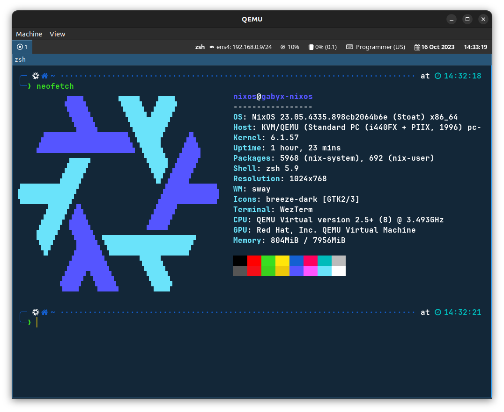

<h1>NixOS Installation</h1>

The file [`configuration.nix`](configuration.nix) contains the whole NixOS
configuration and will be used to install the complete system.

The following steps describe how to end up with a QEMU NixOS installation.

Also we want to build a
[NixOS Installer](https://nixos.wiki/wiki/Creating_a_NixOS_live_CD) at then end
out of the working NixOS.

**Note: This setup is by far kick-ass, its more to get you started on an initial
NixOS, which you then can drive further and even install on real hardware.**



## Prerequisites

Some key insights to ease understanding when working through the below NixOS
install.

- The configuration language `Nix` uses a basic type `String` (e.g. "this is a
  string") and `Path` (`/this/is/a/path`) which are two different things and
  treated differently.

- Check out the manual [NixOs](https://nixos.org/manual/nixos/stable) when
  searching for entry point documentation.

- During modifications consult the two pages:

  - [Package Search](https://search.nixos.org/packages?)
  - [Options Search](https://search.nixos.org/options?)

  for package names and options.

- This NixOS is using the `sway` (Wayland not X11) window manager. To get you
  started when the VM is booted up:

  - `Alt+d` to start a program or
  - press `Alt+Enter` to open `wezterm` terminal with `zsh`.

- The NixOS install is customized with my `.`-files over `chezmoi` which are not
  yet public. [Todo]

## Install NixOS into QEMU Virtual Machine

The documentation [NixOS Manual](https://nixos.org/manual/nixos/stable) provides
useful information when going through these steps:

1. Install `virt-manager` to create a QEMU virtual machine. On Debian systems
   use:

   ```shell
   sudo apt-get install virt-manager
   ```

1. Download the NixOS ISO file from
   [here](https://nixos.org/download#download-nixos).

1. Adjust `.env` file from `.env.tmpl` for your variables.
1. Adjust `.env-os` file from `.env-os.tmpl` for your variables.

### Create VM with `virt-manager` (not recommended)

1. Open `virt-manager` and create a new machine `nixos` by using the
   [downloaded NixOS ISO file](https://channels.nixos.org/nixos-23.05/latest-nixos-gnome-x86_64-linux.iso).
   Create a virtual disk `nixos.qcow2` somewhere.

1. Boot up the virtual machine `nixos` in `virt-manager`. The graphical
   installer should show up. Install NixOS by going through the
   [graphical installer](https://nixos.org/manual/nixos/stable/#sec-installation-graphical).
   Reboot after the install.

### Create VM with Script

1. Create the VM by doing `create-vm.sh` and clicking through the installer. Use
   an LUKS encrypted disk.

### Install Base Tools

1. Start the virtual machine with [`start-vm.sh`](start-vm.sh).

1. Clone this repo (we install git and google-chrome to access passwords)

   ```shell
   NIXPGS_ALLOW_UNFREE=1 nix-env --install --attr nixos.git nixos.google-chrome
   git clone https://github.com/gabyx/nixos-configuration.git
   ```

1. Install some base tools to start working in the fresh NixOS on the
   `/etc/configuration.nix`:

   ```shell
   ./install-tools.sh
   ```

## Connect to VM over SSH

1. Start the virtual machine with [`start-vm.sh`](start-vm.sh).
2. On the host inside a terminal connect over SSH with

   ```shell
   ssh nixos@127.0.0.1 -p 60022
   ```

## Modify NixOS

1. Modify the [`configuration.nix`](configuration.nix) in this repo and use

   ```shell
   ./rebuild-nixos.sh switch
   ```

   to make a new entry in the bootloader with the new system `test`. **We leave
   the system initial `/etc/nixos/configuration.nix` untouched.**

   **Note: Make sure you use your disk id in `boot.initrd.luks.devices`.**

## Resizing the _LUKS Encrypted_ Disk (if disk is full)

If `nixos-rebuild switch` fails due to too little disk space, use the following easy
fix. On the host do the following:

1. Resize the `.qcow2` file with

   ```shell
   source .env-os
   qemu-img resize "$NIXOS_DISK" +40G
   ```

1. Mount the disk with

   ```shell
   source .env-os
   sudo qemu-nbd -c /dev/nbd0 "$NIXOS_DISK"
   ```

1. Run `gparted` with:

   ```shell
   gparted /dev/nbd0
   ```

   and right-click and run `Open Encryption` to decrypt the partition.

1. Use `Partition -> Check` which does an automatic resize to fill the
   partition.

## Running Root GUI Application in Sway

See
[documentation here](https://wiki.archlinux.org/title/Running_GUI_applications_as_root#Using_xhost).
Running root application like `gparted` over `sway` must be done like that:

```shell
sudo -E gparted
```
